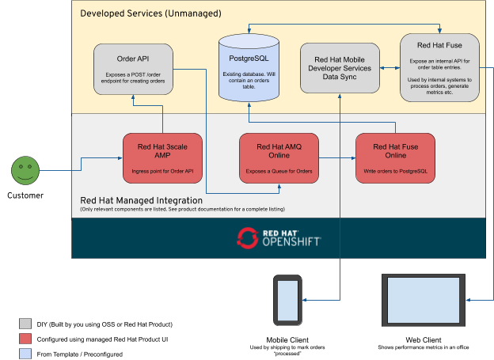

= Create an Ordering Processing Pipeline

In this walkthrough you will create an end-to-end solution for processing
Orders using the Red Hat Managed Integration.

Red Hat Managed Integration is built on OpenShift Dedicated and includes Red
Hat Agile Integration and Red Hat Open Application Runtimes as hosted managed
services.

The image below illustrates the architecture you will create throughout this
walkthrough.

The high-level flow in the architecture is described below:

. Customer places an order via Order API.
.. The API microservice is protected using Red Hat 3scale AMP
.. A single `POST /order` endpoint is exposed
.. Customers must include their API Key in requests
. The API microservice forwards incoming orders to AMQ
.. AMQ exposes a queue over an AMQP interface
.. Orders are stored in the queue until Fuse Online can process them
. Fuse Online will dequeue and process each message in services
.. Processing a message involves writing it to PostreSQL
.. Fuse Online will provide metrics for processing of messages
. etc

[type=walkthroughResource,serviceName=openshift]
.Red Hat OpenShift
****
* link:{openshift-host}/console[Console, window="_blank"]
* link:https://help.openshift.com/[Openshift Online Help Center, window="_blank"]
* link:https://blog.openshift.com/[Openshift Blog, window="_blank"]
****

[type=walkthroughResource,serviceName=fuse]
.Fuse Online
****
* link:{fuse-url}[Console, window="_blank", id="resources-fuse-url"]
****

[type=walkthroughResource,serviceName=amq-online-standard]
.AMQ Online
****
* link:{enmasse-url}[Console, window="_blank", , id="resources-enmasse-url"]
****

[type=walkthroughResource,serviceName=codeready]
.CodeReady Workspaces
****
* link:{che-url}[Console, window="_blank"]
* link:https://developers.redhat.com/products/codeready-workspaces/overview/[{code-ready-service} Overview, window="_blank"]
* link:https://access.redhat.com/documentation/en-us/red_hat_codeready_workspaces_for_openshift/1.0.0/[{code-ready-service} Documentation, window="_blank"]
****

[type=walkthroughResource,serviceName=3scale]
.3Scale
****
* link:{api-management-url}[Console, window="_blank"]
* link:https://developers.redhat.com/products/3scale/overview/[3Scale Overview, window="_blank"]
* link:https://www.3scale.net[3Scale Website, window="_blank"]
****

[time=5]
== Explore the Project Namespace and Configure PostgreSQL

When you started this walkthrough a *Project* was automatically created on
this OpenShift Cluster for you. link:{openshift-host}/console/project/{walkthrough-namespace}[Click here, window="_blank"]
to open the *Project* in the OpenShift.

You'll notice that a PostgreSQL database has already been deployed for you.

=== Exploring the Project Namespce
You will get familiar with the OpenShift Console *Overivew*,
*Deployment Config*, and *Deployment* screens in this section.

. Click the *Overview* item in the side menu of the *Project*.
. Find the PostgreSQL instance on the *Overview* screen and expand it using the arrow beside it.
. Take note of the various information provided such as the *Image*, *Ports* and reosurce usage graphs.
. Click the *postgresql* name under the *Deployment Config* to view the details of the current *Deployment Config*.
. Select the latest *Deployment* in the *History* list by clicking number with the `(latest)` label.
. The *Deployment* screen contains detailed information about the current deployment.

=== Configure PostgresSQL
. Navigate to your link:{openshift-host}/console/project/{walkthrough-namespace}[OpenShift Project Overview, window="_blank"].
. Expand the *Applications* section in the side menu and select *Pods*.
. Select the *Pod* with the prefix `postgresql`.
. Select the *Terminal* tab on the *Pod* overview screen. This will provide
you with a shell that you can use to execute commands in the running
PostgreSQL container.
. Satrt a session with PostgreSQL by entering the `psql` command.
. Connect to the Orders database by entering the `\c orders;` command.
+
. Enter the following SQL statement to create the a table for the Orders API:
+
[subs="attributes+"]
----
CREATE TABLE received_orders (
   id serial NOT NULL PRIMARY KEY,
   item_id int NOT NULL,
   quantity int NOT NULL,
   processed boolean NOT NULL DEFAULT FALSE
);
----

[type=verification]
====
Check that the following table was created by issuing the `\d;` command.

Is the `received_orders` table listed?
====

[type=verificationFail]
Verify that you followed each step in the procedure above. Ensure you copy the
SQL statement exactly and issue it when connected to the `orders` database.

[time=5]
== Create an Orders Queue in AMQ Online

=== Subtask Title

. Do first step.
. Do second step.

[time=15]
== Develop and Deploy the Public Order API

=== Subtask Title

. Do first step.
. Do second step.

[time=10]
== Expose the Order API via 3scale

=== Subtask Title

. Do first step.
. Do second step.

[time=15]
== Create an Integration using Fuse Online

=== Subtask Title

. Do first step.
. Do second step.

[time=15]
== Expose an Internal Orders API using Fuse

=== Subtask Title

. Do first step.
. Do second step.

[time=10]
== Deploy an in-house Mobility Solution with Realtime Sync

=== Subtask Title

. Do first step.
. Do second step.
